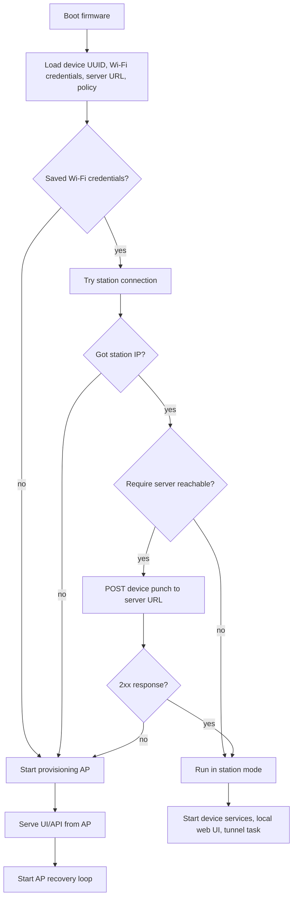
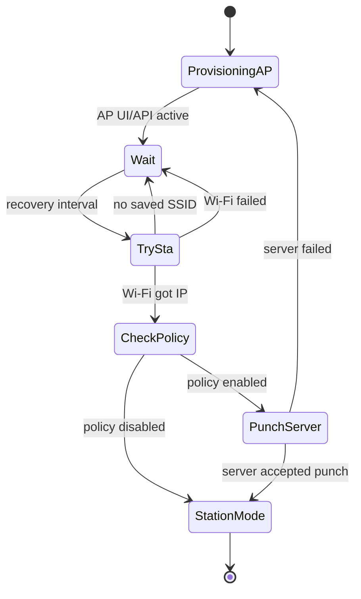
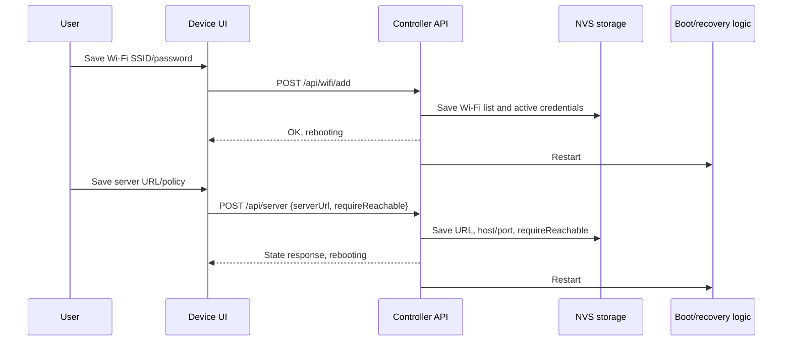

# Network Provisioning and Recovery

The controller has two network personalities:

- **Station mode**: joins a saved Wi-Fi network and runs the local device UI/API
  on the assigned LAN address.
- **Provisioning AP mode**: creates an `ac_<uuid-suffix>` Wi-Fi access point
  with password `pyfitech`, serves the same UI/API at `192.168.4.1`, and keeps
  retrying the saved station network.

The default policy is strict: station mode is accepted only when the controller
can join Wi-Fi and the configured server URL accepts the device punch. The
default server URL is:

```text
https://open-automation.org/devices
```

That public URL is intentionally narrow. Unauthenticated `POST /devices` is
accepted as the controller punch-in route, while browser/UI `GET /devices/` is
protected with Basic auth. The unauthenticated public dashboard is not exposed;
the private Device Manager UI/API remain available on the internal network at
`http://192.168.1.40:8102/` and through authenticated `/devices/` access.

The server URL and the controller's raw tunnel socket are separate settings.
Saving `https://open-automation.org/devices` must not rewrite the tunnel host
or port; the tunnel uses explicit tunnel settings when present, otherwise its
firmware default.

The Settings page exposes **Require server before station mode**. When enabled,
Wi-Fi without server reachability falls back to AP mode. When disabled, joining
Wi-Fi is enough and the tunnel can recover independently later.

## Boot Decision



## AP Recovery Loop

AP mode is not a dead end. The controller keeps the provisioning UI available
while periodically trying the saved station network again.



During recovery, the controller uses AP+STA mode for the probe so a user can
stay connected to the setup AP while the device tests the saved network. The
server punch is performed in the recovery task itself to avoid allocating an
extra TLS task while the AP UI and device services are already running. If the
probe passes, the controller switches to station-only mode and starts the tunnel
task. If the probe fails, it returns to AP-only mode and waits for the next
interval.

## Settings Flow



## Operational Rules

1. The controller first tries the active saved Wi-Fi network.
2. If station association or DHCP fails, it enters provisioning AP mode.
3. If station succeeds and `requireReachable=true`, the configured server URL
   must accept the device punch with a 2xx response.
4. If the punch fails under the strict policy, the controller enters AP mode.
5. AP mode serves the same UI/API and periodically retries station recovery.
6. If `requireReachable=false`, station mode does not depend on server
   reachability. The tunnel can recover independently later.
7. The ESP-IDF certificate bundle must support the current
   `open-automation.org` chain, including cross-signed roots used by Google
   Trust Services.
8. Server URL saves update only the punch/check URL and legacy server host/port
   fields. They do not update `tunnel_host` or `tunnel_port`.

## Verification Checklist

- For the full deploy/test workflow, including two-network switching between
  saved networks, AP fallback, Device Manager OTA, and browser screenshots, see
  `docs/CONTROLLER_DEPLOY_AND_TEST.md`.
- `GET /api/state` includes `server.requireReachable`.
- `GET /api/state` includes live station link metrics when connected:
  `wifi_sta_quality`, `wifi_sta_rssi`, `wifi_sta_gateway`,
  `wifi_sta_channel`, `wifi_sta_auth`, and `wifi_sta_bssid`.
- Settings page shows **Require server before station mode** and posts the value
  as `requireReachable`.
- Settings page **Active network** shows SSID, link quality/RSSI, connected
  age, STA IP, gateway, STA MAC, AP BSSID, channel, and security.
- With valid Wi-Fi and reachable `https://open-automation.org/devices`, boot
  remains in station mode.
- With valid Wi-Fi and unreachable server URL while the policy is enabled, boot
  falls back to AP mode.
- With the policy disabled, valid Wi-Fi remains station mode even when the
  server URL is unavailable.
- In AP mode, the recovery loop retries the saved Wi-Fi and server policy on a
  regular interval.
- `npm run test:server-route` passes, proving the public route accepts punch-in
  posts and does not expose the dashboard.
